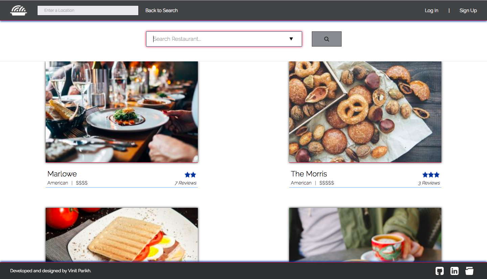

# InstaRes

[InstaRes][instares] is a web application that allows users to browse popular restaurants as well as host their own restaurants. Originally inspired by [OpenTable][opentable], it also allows users to make reservations, write reviews, and track favorites.

## Functionality & MVP

- Authenticated user accounts
- Single-page app
- Add, edit, update, remove restaurants with image upload
- Search for restaurants by location
- User profile
- Reservations
- Favorites
- Reviews
- Proper error handling

## Architecture and Technologies

InstaRes was planned and created in about two weeks time. The planning process involved creating [wireframes][wireframes], a sample frontend [state][state], and a [database schema][database schema]. One feature was carried out from back to front entirely before moving on to another. The app is built with the following:

- Backend: Ruby on Rails
- Frontend: React/Redux
- DB: Postgres RDBMS

The backend is implemented almost exactly how the original proposal schema describes. By providing API endpoints, the backend communicates with the frontend through AJAX requests and responses. On the frontend, React.js is used alongside the Redux cycle, allowing for a quick, efficient, and enjoyable user experience.

Images used throughout the application are hosted on [Cloudinary][cloudinary].

In addition to the cloudinary API, two other APIs were involved in this project. The Yelp web API was utilized to seed the database with many restaurants without using brute force, greatly simplifying the process. The Google Maps API was also integrated for the autocomplete search.

## Future Improvements

Future steps may include:

#### Notifications and Email Confirmation

- Confirm with users before making reservations or deleting favorites, reviews, or restaurants
- Email users confirmations upon all of the above actions

#### Google Maps Integration

- Provide a visible map for users utilizing Google Maps API
- Update query results based on map zoom

#### Search Filters

- Filter query results by price, category, and/or ratings
- Sort query results based on closest to furthest

#### User Point System

- Reward system for frequent users
- Email users after reservations have passed

[instares]: http://www.instares.space
[opentable]: http://www.opentable.com
[cloudinary]: http://www.cloudinary.com
[wireframes]: ./docs/wireframes
[state]: ./docs/sample-state.md
[database schema]: ./docs/schema.md
