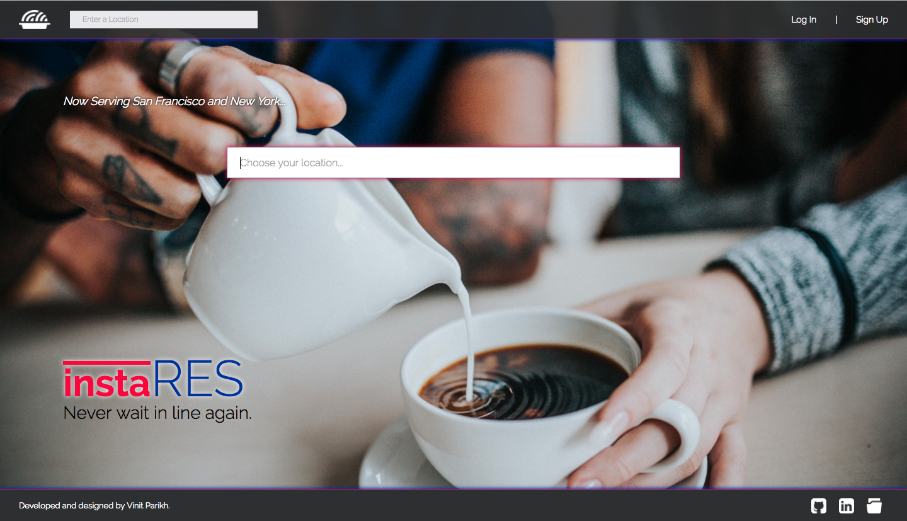
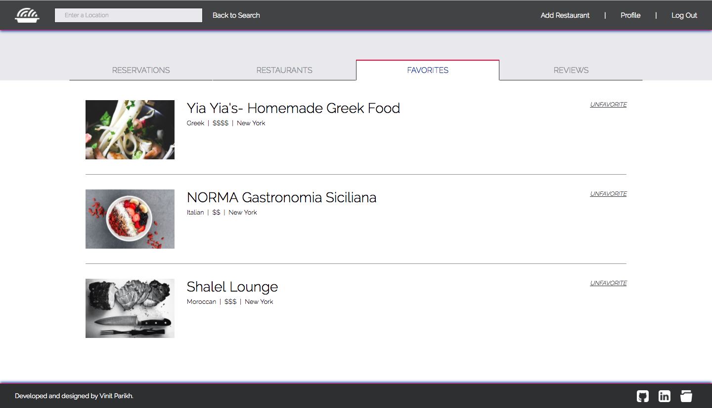
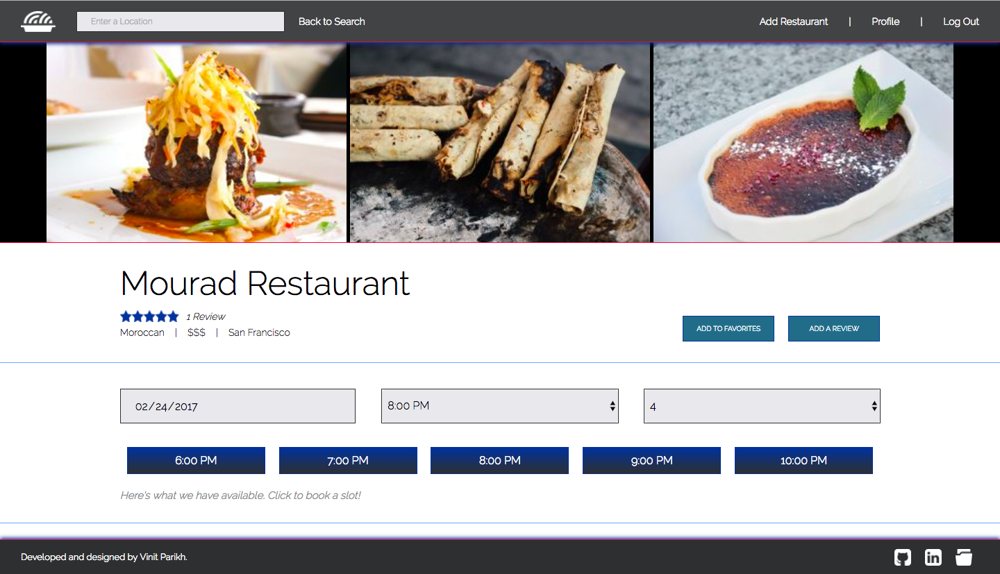

# InstaRes

[InstaRes][instares] is a web application that allows users to browse popular restaurants as well as host their own restaurants. Originally inspired by [OpenTable][opentable], it also allows users to make reservations, write reviews, and track favorites.



## Functionality & MVP

- Authenticated user accounts
- Single-page app
- Add, edit, update, remove restaurants with image upload
- Search for restaurants by location
- Reservations
- Favorites
- Reviews
- Proper error handling
- User profile



## Architecture and Technologies

InstaRes was planned and created in about two weeks time. The planning process involved creating [wireframes][wireframes], a sample frontend [state][state], and a [database schema][database schema]. One feature was carried out from back to front entirely before moving on to another. The app is built with the following:

- Backend: Ruby on Rails
- Frontend: React/Redux
- DB: Postgres RDBMS

The backend is implemented almost exactly how the original proposal schema describes. By providing API endpoints, the backend communicates with the frontend through AJAX requests and responses. On the frontend, React.js is used alongside the Redux cycle, allowing for a quick, efficient, and enjoyable user experience.

Images used throughout the application are hosted on [Cloudinary][cloudinary].

In addition to the Cloudinary API, two other APIs were involved in this project. The Yelp web API was utilized to seed the database with many restaurants without using brute force, greatly simplifying the process. The Google Maps API was also integrated for the autocomplete search.

## Highlights

A few portions of code are highlighted here:

The following code enforces that the user be logged in in order to carry out specific actions. More importantly it also ensures that a user cannot access another user's private information even by hardcoding in a URL. The errors are cleared using a function below to ensure that they don't persist from page to page as the user continues to use the site.

  ```javascript
  const _requireLogin = (nextState, replace) => {
    if (!store.getState().session.currentUser) {
      replace("/");
    }
  };

  const _clearErrors = () => {
    store.dispatch(clearErrors);
  };

  const _requireUser = (nextState, replace) => {
    if (!store.getState().session.currentUser) {
      replace("/");
    } else {
      let userRestaurants = Object.keys(store.getState().session.currentUser.restaurants);
      if (!userRestaurants.includes(nextState.params.restaurantId)) {
        replace(`/restaurants/${nextState.params.restaurantId}`);
      }
    }
  };
  ```

  To ensure a positive UX while also enforcing functionality criteria, the booking buttons are not rendered unless the user is logged in and is not the owner of the restaurant. It wouldn't make sense for a user to book a table at their own restaurant. Similarly, users are not given the option to write reviews for restaurants that they own; hence, the 'Add Review' button is not displayed for them. Below is a code sample that shows how such situations are handled.

  ```javascript
  if (!this.props.currentUser || this.props.currentUser.id ===
      this.props.restaurant.owner_id || this.state.date === "" ||
      this.state.party_size === "") {
    return (
      <div className='bookings'>
        <div>
          {this.renderMessage(openSlots.length)}
        </div>
      </div>
    );
  } else {
    return (
      <div className='bookings'>
        <div className='booking-buttons'>
          {
            openSlots.map((sl, idx) => (
              <button key={idx} onClick={this.handleSubmit.bind(this, sl)}>{sl}</button>
            ))
          }
        </div>

        <div>
          {this.renderMessage(openSlots.length)}
        </div>
      </div>
    );
  }
  ```

  

  In sum, the code for this site is written to model a real life version of such a site from the core functionality all the way to the styling on the outside. Errors are rendered where needed, user information is secure, and navigation through the site is made to be an intuitive and enjoyable experience.

## Future Improvements

All programs and applications could always use more features. Some possible future steps may include:

#### Notifications and Email Confirmation

- Confirm with users before making reservations or deleting favorites, reviews, or restaurants
- Email users confirmations upon all of the above actions

#### Google Maps Integration

- Provide a visible map for users utilizing Google Maps API
- Update query results based on map zoom

#### Search Filters

- Filter query results by price, category, and/or ratings
- Sort query results based on closest to furthest

#### User Point System

- Reward system for frequent users
- Email users after reservations have passed

[instares]: http://www.instares.space
[opentable]: http://www.opentable.com
[cloudinary]: http://www.cloudinary.com
[wireframes]: ./docs/wireframes
[state]: ./docs/sample-state.md
[database schema]: ./docs/schema.md
